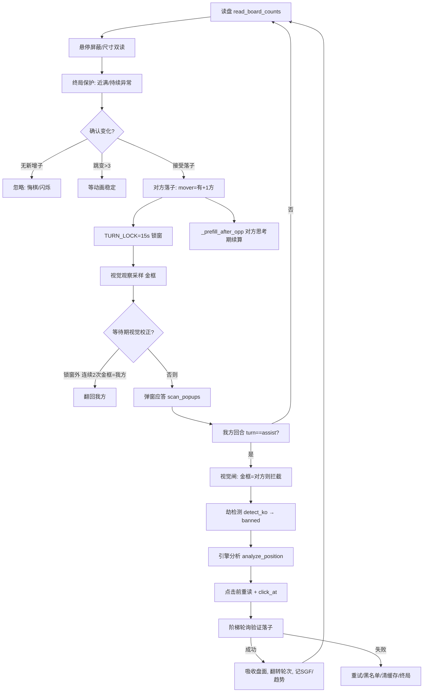

# 调用逻辑

本文描述 UI 如何拉起主控、主控主循环的状态机、回合翻转的两类事件、以及终局/续战流程。行号以 `katago_play.py` 为主。

## 1. UI → 主控 启动

`katago_ui.py` 点「启动自动落子」→ `start_play()` 用 `subprocess` 拉起：

```
python katago_play.py auto --mode <模式> --visits <算力> [--wait-new ...]
```

- 子进程 stdout 经 `_Tee` 同时镜像到 `katago_ui.log`（`main():1077` 起），UI 侧 `poll_log` 读取并刷新日志区。
- UI `poll_board` 调 `br.read_current`（UI 侧镜像），`poll_state` 读 `ui_state.json`（`_set_st` 写入），经 `_drain_q` 队列刷新；操作按钮（启动/观战/分析/停止）保留，旧的「游戏按钮投影条」已移除。

## 2. 主控启动序列 `main()` (`katago_play.py:1073`)

1. 解析参数：执色 `assist`、先手 `--turn`、`--visits`、`--size`、`--mode`、`--wait-new`、`--beep`、`--detect-first`、`--max-games`（`:1109`–`:1136`）。
2. 引擎预热线程 `_warm`（`:1138`）。
3. 等待窗口（≤30s，动态 PID，`br.window_rect` 抛 `SystemExit` 表示未找到）（`:1154`）。
4. 稳定化读盘（连续两读一致 + OCR 标题纠错）（`:1183` 附近）。
5. **执色识别**：`auto` → `winclick.avatar_my_color()`（角标）（`:1258`）。
6. **场景安检** + **锚定轮次**：空盘=黑先手；否则金框 `anchor_turn_visual()`（`:1301`–`:1341`）。
7. `trend_reset` + 记第 0 点（`:1320`）。

## 3. 主循环状态机 `while True` (`katago_play.py:1386`)



核心节奏：`read_board_counts` 约 0.3s/轮（`:1388`）。

## 4. 回合翻转的两类事件

当前版本**只有两类**会翻转 `turn` 的事件（不靠横幅 OCR 即时翻转）：

1. **对方落子（确认盘面变化）**：连续 2/3 读确认有新增子 → `mover = 有 +1 的一方`，`turn = other(mover)`（`:1576`–`:1577`），同时 `TURN_LOCK['until'] = now + 15s`（`:1578`，锁窗防金框滞后误翻）。
2. **我方落子成功**：阶梯轮询验证落子后，翻转 `turn`（`:2363` 附近）。

> 之所以去掉「横幅 OCR（`ocr_turn`/`_match_turn_items`）即时翻转」：横幅并非轮次真值，且金框是确定性的唯一判据，没必要再叠加不可靠来源。

## 5. 回合锁窗（防滞后误翻）

```python
# katago_play.py:742 / :1578 / :1675
TURN_LOCK_SECS = 15.0
TURN_LOCK = {'until': 0.0}

# 等待期视觉校正（仅在锁窗外、>12s、连续2次金框=我方 才翻回我方）
if (turn != assist and time.time() - last_change > 12.0
        and not _vis_flipped
        and time.time() >= TURN_LOCK['until']):
    ...
```

逻辑：对方落子后，金框横幅有数秒滞后仍显示「我方行棋」；锁窗 15s > 实测滞后窗（<8s），期间屏蔽「等待期视觉校正翻回合」，避免把回合误翻回我方导致重复点击。

## 6. 终局 / 续战 `end_or_wait()` (`katago_play.py:847`)

- 终局/异常出口：打印原因、蜂鸣、`save_game_sgf(final=True)`（`:851`–`:854`）。
- **非 `--wait-new`**：返回 `None`（停止）。
- **`--wait-new`**：`AUTO_NEXT=True`，进入续战循环（≤10 分钟）：
  1. 检测是否已在下一盘（小盘面 `counts<=4`）→ 清 `grid` 缓存、`GAME_MOVES`、`GAME_LAST_KEY`、局数 +1，返回新局读数（`:866`–`:882`）。
  2. 否则每 ~6s OCR 找 `[重新匹配]`，点中后 `click_confirm()` 确认弹窗（`:883`–`:905`）。
  3. 连续 10 次未找到「重新匹配」则改找「续战」（对方认输后常只有续战）（`:888`–`:892`）。
  4. 再找不到则停止自动续战（`:893`–`:895`）。

## 7. 弹窗应答 `scan_popups()`

主循环每轮调用，3s 节流：识别并应答「求和/数子/认输/和棋」等弹窗（点确认/继续），避免卡在弹窗。认输弹窗走 `resign_ok` 分支接 `end_or_wait` 续战。

## 8. 执色并行观察 `color_observer_loop()` (`katago_play.py:371`)

后台线程每 ~10s 独立采样 `winclick.avatar_my_color()`（含 OCR 页面闸门，非对局页跳过）。**仅记录观察 `_OBS_SIDE`**；判定仍以启动/开局锚定为准（分先换色场景由自动续战时的角标核查处理，`:1740`）。
