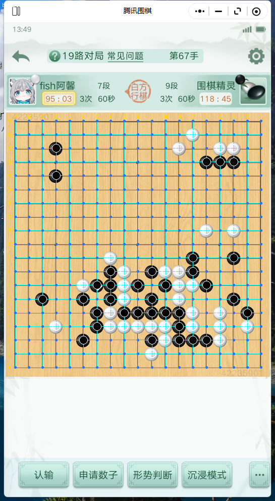

# 识别逻辑

本工具所有决策来自屏幕像素，分四层：**网格 → 棋子 → 执色 → 回合（金框）**，外加 **劫检测** 与 **悬停/末手噪声抑制**。行号以 `board_reader.py` / `winclick.py` / `katago_play.py` 为准。

## 0. 坐标空间

- **窗口相对像素**：所有 ROI 以腾讯围棋渲染窗口左上角为原点。`avatar_calib.json` 的 `my`、金框 `GOLD_ROI`、`grid_calib.json`（屏幕坐标减 `win_x0/wy0`）都换算到该空间。
- 截图：`ImageGrab.grab(bbox=rect)`（`board_reader.py:1348`），`rect = window_rect(PID)`。

## 1. 网格检测（`board_reader.py`）

- 入口：`read_current()`（`:1339`）→ `read_img()`（`:1366`）。
- **网格来源优先级**：校准（尺寸匹配）→ 全自动定位（`locate_board`）→ 复用同窗口尺寸下本局最近成功网格（`_grid_cache`，漂移 `dr<=3.5` 且 `board_visible`）。
- 漂移校正：每帧 `refine_grid` 微调交点坐标，避免长对局累积偏移。
- **模式偏移** `MODE_GRID_OFFSET`（`board_reader.py:44`）：不同对局模式（match/challenge/ai/friend）棋盘在窗口中的位置不同，`set_game_mode()`（`:53`）切换。

```python
# board_reader.py:44
MODE_GRID_OFFSET = {
    'match': (0, 0), 'challenge': (0, 0), 'ai': (0, 0), 'friend': (0, 0),
    # 其余模式按需填写偏移
}
```

> 标定产物 `grid_calib.json`（`mode/screen` 坐标 + `size/win_*`）即网格的持久化来源，缺失或尺寸不符时回退全自动定位。

## 2. 逐点棋子判定

- 对每个网格交点取邻域 patch，按色相/亮度分类为黑(X)/白(O)/空(.)。
- **死子剔除**：`stones_legal()`（`:1637`）按围棋气规则移除零气组（已被提/死子），输出给 KataGo 的合法落子序列 `[[b/w, GTP], ...]`：

```python
# board_reader.py:1670
letters = 'ABCDEFGHJKLMNOPQRST'[:n]   # 跳过字母 I
stones.append(['b' if c == 'X' else 'w', letters[j] + str(n - i)])
```

- 坐标：(i=行, j=列)，GTP 串为 `列字母 + (n-i)`（行号从底向上）。

## 2.5 坐标与棋子色块识别诊断视图

下图来自 `board_reader.read_current()` 的诊断叠加层（真实对局截图），直接展示网格定位与逐点棋子判读结果：



**画面上方标题栏的读数说明**：
- `board 19x19 step=27.4` — 识别到 19 路棋盘，网格步长约 27.4 像素；
- `white=52 black=48 empty=261` — 白子 52 颗、黑子 48 颗、空点 261 个；
- `white=white circle` — 白子用**白色圆圈**标记；
- `black=black dot` — 黑子用**黑色圆点**标记；
- `blue dot=empty` — 空点用**蓝色小点**标记。

**核验清单**：
- 青色网格线是否压住实际棋盘线；
- 黑白子上的标记点是否落在棋子亮度中心；
- 空点的蓝色小点是否均匀落在交叉点上；
- 若个别点错判，检查 `stone_r` 与亮度阈值（`board_reader.py`）；若整体偏移，重标 `grid_calib.json`。

## 3. 执色判定 —— 头像角标（唯一）

- `winclick.avatar_my_color()`（`:542`）是**唯一**执色来源：只读我方头像角标，对方不参与。
- 流程：`avatar_my_box()`（`:255`）读 `avatar_calib.json` 的 `my:[x0,y0,x1,y1]` → 多帧投票 `_my_stone_vote()`（`:515`，同色连续 2 帧采信）→ `classify_avatar_box()`（`:277`）判黑/白。
- 仅在**对局页**（`_is_game_page`，`:501`，检测「段/级」名字行或「第N手」）执行；失败退回旧路径兜底。

```json
// avatar_calib.json（窗口相对像素，win_w/win_h=545/992）
{ "win_w": 545, "win_h": 992,
  "my": [54, 133, 84, 163] }   // 我方头像角标框
```

> 早期版本另有「绿框/子数奇偶/角标竖条/配对法」等执色方案，现已统一到头像角标，余者已删除。

## 4. 回合判定 —— 金框（唯一判据）

- 核心：`winclick.gold_frame_ratio()`（`winclick.py:470`），返回 ROI 内金黄色像素占比或 `None`。
- **金黄色判据**：`R-B>90 且 R-G<90 且 G-B>40`（有别于木色 R>G>B 平缓、UI 白/灰）。
- **ROI 与阈值**：`GOLD_ROI=(80,180,150,210)`（`:466`），`GOLD_THR=0.094`（`:467`）。
- 判读：`占比 >= 阈值` → 我方行棋；`< 阈值` 或 `None`(采样失败) → 对方行棋。实测两态区分度约 **5.7 倍**（我方 ~0.22 / 对方 ~0.04）。

```python
# winclick.py:466
GOLD_ROI = (80, 180, 150, 210)      # x0,y0,x1,y1 (窗口相对像素)
GOLD_THR = 0.094                    # 判据阈值
```

- 调用方：`visual_turn()`（`katago_play.py:269`，主循环每轮视觉观察）与 `anchor_turn_visual()`（`:300`，开局锚定）。两者均**只有金框**一种判据，采样失败一律返回不确定由上游重试，不猜。
- 空盘铁律：`anchor_turn_visual` 在空盘（`counts==0`）直接锚定 `turn='black'`（黑先手），无需视觉判定。

## 5. 劫检测 `detect_ko()`（`board_reader.py:1678`）

- 仅在**我方即将提劫**场景调用（落子前禁手），识别标准 2×2 交替劫形：
  - 空点 P 只有一个正交邻子，且为对方单子、仅此 1 气（正被打吃）；
  - P 的两个对角为我方子；
  - 满足即判 P 为**劫点**，返回 GTP 串（如 `'G3'`），加入 `banned` 交给 `analyze_position` 作为禁着。
- 普通吃子（梯/边角）劫点会有 ≥2 个正交邻子，不会被误判。
- 调用链：`katago_play.py` 我方回合 → `br.detect_ko(n, board, my_char)` → `banned` → `analyze_position(..., banned=...)`。

## 6. 悬停 / 末手噪声抑制

- **落子预览方块**：空盘时我方光标压格会显示实心方块，被读成「唯一一颗我方子」。`strip_hover_square()`（`katago_play.py:346`）检测盘面恰 1 子且光标在其上 → 归零。
- **末手高亮**：`cursor_hover_cell()` 识别光标所在格，用于区分预览方块与真实落子。
- **提子动画**：我方落子后等提子动画稳定再重读（`:1950`），避免读半截盘面。
- **跳变保护**：读盘出现 `跳变>3` 子时等动画稳定（`:1536`），新增 0 子则当悔棋/闪烁忽略（`:1496`）。

## 7. 识别精度要点（详见 [screenshots-calibration.md](screenshots-calibration.md)）

| 环节 | 失效表现 | 根因 | 处理 |
|---|---|---|---|
| 网格 | 全盘读不出 / 偏移 | 窗口缩放、模式偏移 | 重标定 `grid_calib.json` / 校正 `MODE_GRID_OFFSET` |
| 执色 | 判反 | `avatar_calib.json` 过期 | 重跑 `avatar_calib.py` |
| 回合 | 误判对方行棋 | `GOLD_ROI` 错位 | 重标定金框 ROI |
| 棋子 | 死子未剔 / 漏子 | 提子动画中读取 | 等动画稳定后重读 |
