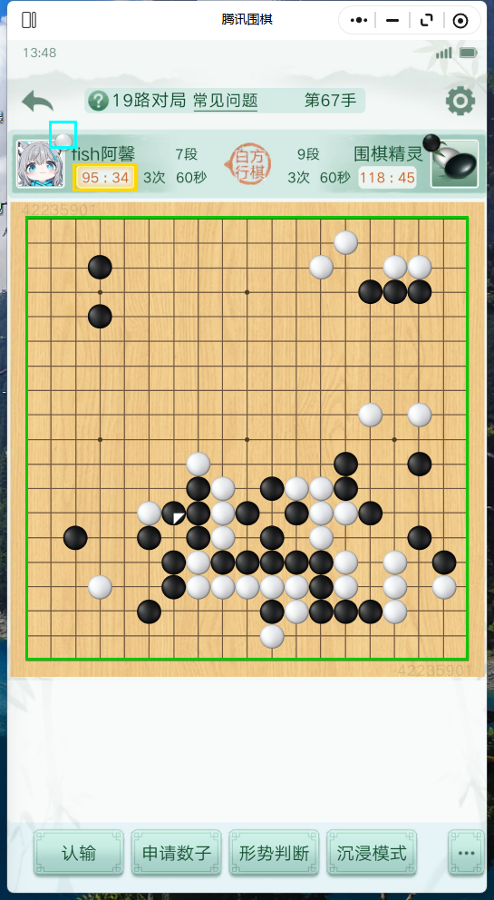
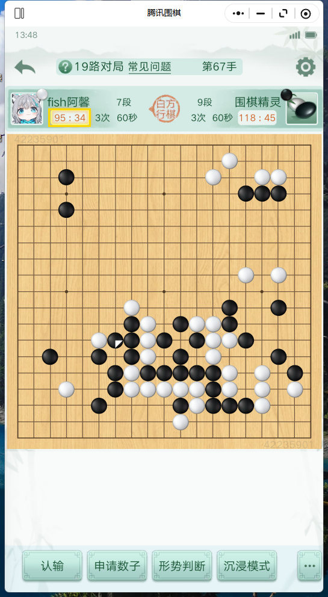
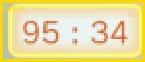
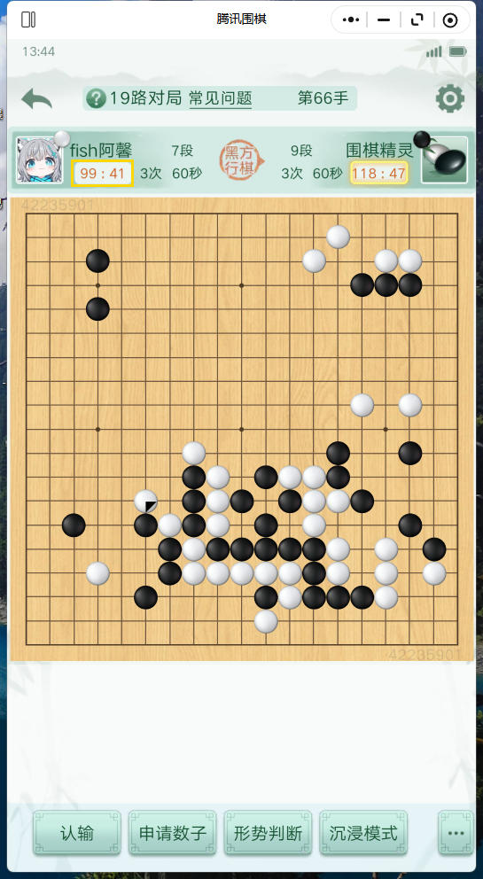
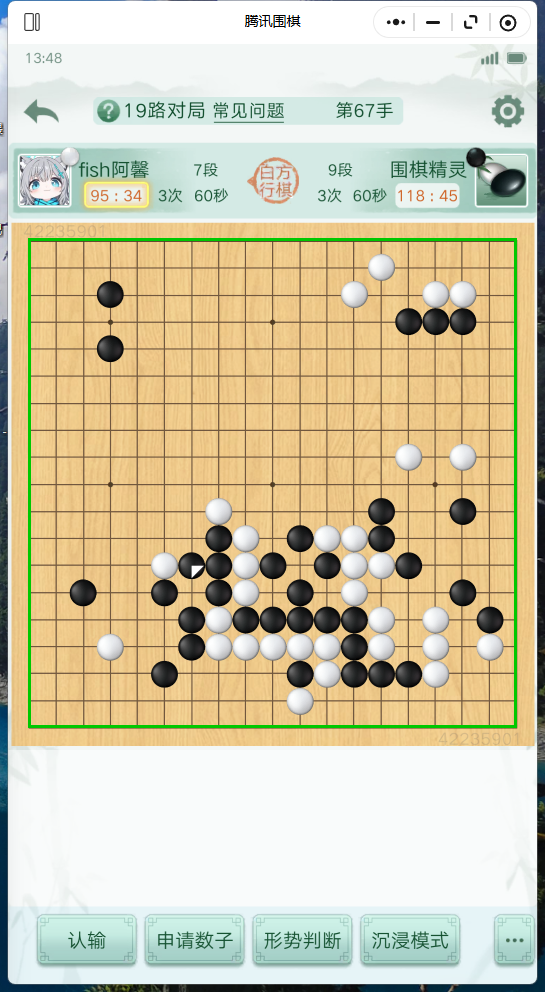

# 截图与坐标标定

本文用**实时抓取的对局窗口截图 + ROI 框选标注**说明四个关键识别节点，并给出标定/重标定方法。所有截图由 `docs/_make_shots.py` 现场抓取当前对局窗口并叠加标注框生成（窗口像素 1:1，窗口尺寸 545×992）。

图例：<span style="color:#00FFFF">■ 青色=我方头像角标</span> · <span style="color:#FFD700">■ 金黄=金框 ROI</span> · <span style="color:#00C800">■ 绿色=棋盘框</span>

## 1. 窗口总览（节点：定位）



左边栏为我方头像（青框 `my=[54,133,84,163]`），中下为棋盘（绿框，由 `grid_calib.json` 屏幕坐标换算窗口坐标 `(28,238)-(516,727)`），金框 ROI（黄框 `(80,180)-(150,210)`）位于棋盘上方倒计时区。

## 2. 回合判定：金框（核心节点）

金框 = 腾讯围棋倒计时区的**金黄色空心框**，仅在我方行棋时出现。

**我方行棋（有金框）** —— `gold_frame_ratio >= 0.094`：

  ← 黄框内可见金框

  ← ROI 放大裁剪（脚本生成，3×）

**对方行棋（无金框）** —— ROI 占比 < 阈值：

  ← 黄框内无金框

实测两态占比：我方 ≈0.22 / 对方 ≈0.04（区分度 ~5.7×）。

### 金黄色判据（代码）

```python
# winclick.py:470  gold_frame_ratio
R, G, B = s[:, :, 0], s[:, :, 1], s[:, :, 2]
return float(((R - B > 90) & (R - G < 90) & (G - B > 40)).mean())
```

ROI 定义：`GOLD_ROI=(80,180,150,210)`（`:466`），`GOLD_THR=0.094`（`:467`），均为**窗口相对像素**。

## 3. 执色判定：头像角标（节点）

  ← 我方头像角标放大裁剪（青框）

`winclick.avatar_my_color()` 只读该角标框内棋子颜色（多帧投票），对方角标不参与。标定写 `avatar_calib.json`：

```json
{ "win_w": 545, "win_h": 992, "my": [54, 133, 84, 163] }
```

## 4. 棋盘网格与落点（节点）

  ← 棋盘绿框（19×19，窗口相对坐标经 grid_calib.json 换算）

交点由 `locate_board`/`refine_grid` 给出（窗口相对）；落子时叠加 `grid_calib.json` 的 `win_x0/win_y0` 得屏幕坐标后 `post_click`。

坐标与棋子色块诊断视图（现场抓取 + `read_current` 读盘叠加，含网格线 / A–T 列字母 / 黑白子与空点色块）：


> 详见 [`recognition.md` §2.5](recognition.md#25-坐标与棋子色块识别诊断视图) 中对标题栏读数与各色标记的完整说明。

## 5. 如何重标定金框 ROI（GOLD_ROI）

当游戏更新/窗口布局改变导致金框错位、误判回合时重标：

1. 截图当前对局页（我方行棋态），得到窗口尺寸 `W×H` 与金框实际像素位置。
2. 量金黄框左上/右下窗口相对坐标 `(x0,y0,x1,y1)`，更新 `winclick.py:466`：
   ```python
   GOLD_ROI = (80, 180, 150, 210)   # 改为实测值
   ```
3. 阈值 `GOLD_THR`（`:467`）取两态占比的几何中点即可（我方 0.22 / 对方 0.04 → 中点 ≈0.094）。
4. 复跑 `python docs/_make_shots.py` 验证框选位置无误。

## 6. 如何重标定头像角标 / 棋盘

- **头像角标**：运行 `avatar_calib.py`，按提示框选我方头像区域的棋子，写 `avatar_calib.json` 的 `my`。
- **棋盘网格**：运行标定脚本写 `grid_calib.json`（`mode/screen/x0/y0/x1/y1/size/win_*`）。若仅分辨率变了，可手动改 `win_x0/win_y0/win_w/win_h` 与 `screen_w/screen_h`，脚本按 `窗口坐标 = 屏幕坐标 - (win_x0, win_y0)` 换算。
- 标定后务必在「我方行棋/对方行棋」两种状态下各验一次金框与执色判读。

## 7. 标注脚本（可复跑）

`docs/_make_shots.py` 直接抓取当前腾讯围棋对局窗口（经 `capture_frames.grab_frame` + `board_reader._find_game_window` + `ImageGrab`）生成全部标注图，仅依赖 Pillow / numpy：
- 轮询抓帧，按 `gold_frame_ratio` 区分「我方行棋帧（有金框）/ 对方行棋帧（无金框）」，叠加金框/头像角标/棋盘框；
- 调用 `read_current` 读盘，叠加网格线、A–T 列字母、黑白子与空点色块生成 `snap_overlay`。

运行前提：对局页处于打开状态。重跑命令：

```bash
python docs/_make_shots.py
```
